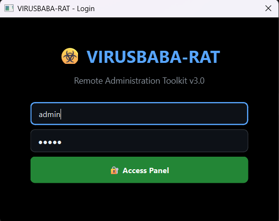
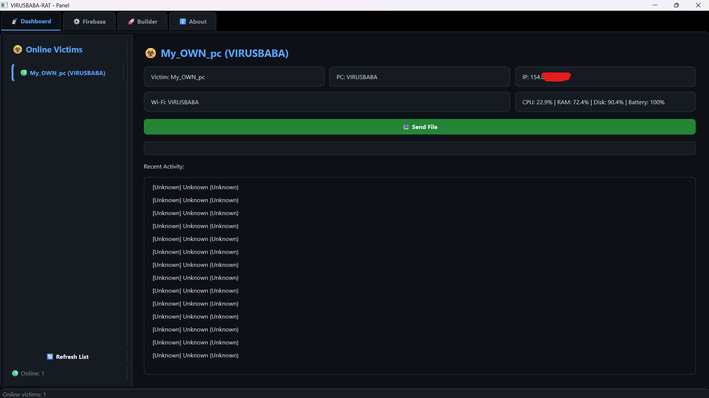
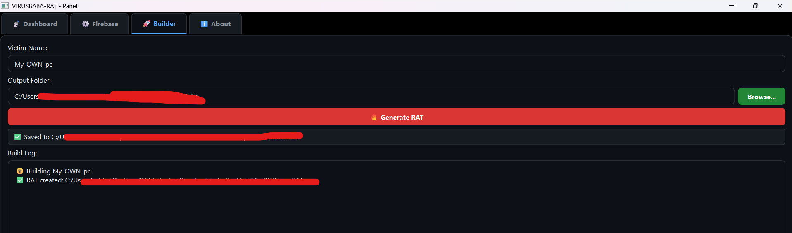
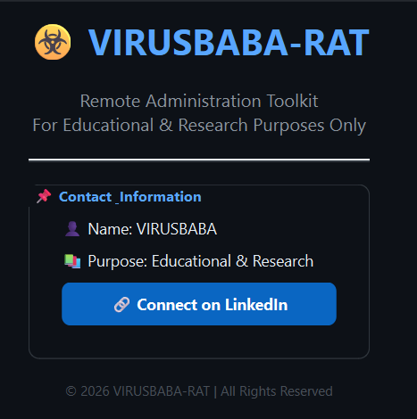

# ☣️ VIRUSBABA-RAT
### **Remote Administration Toolkit for Educational & Research Purposes**

[](#)
[](#)
[](#)

---

## 📌 Overview

**VIRUSBABA-RAT** is a lightweight, educational Remote Administration Toolkit built with **Python** and **Firebase**. It is designed to demonstrate how remote monitoring and file transfer systems work behind the scenes.

> [!IMPORTANT]  
> **Educational & Authorized Auditing Only:** This project is intended **ONLY** for educational purposes, authorized security testing, and personal research. You must have explicit permission from the system owner before using this tool. The author is not responsible for any misuse or damage.

---

## ✨ Features

*   **📡 Real-Time Victim Monitoring**
    *   System details: Hostname/PC Name, Public IP, Wi-Fi SSID.
    *   Hardware metrics: Real-time CPU, RAM, Disk, and Battery usage.
    *   Active environment: Focus window title and active process tracking.
*   **📤 Remote File Transfer**
    *   Send any file type (`.exe`, `.bat`, `.pdf`, `.jpg`, etc.).
    *   Payload downloads and automatically executes the file on the victim's PC using default Windows associations.
*   **☁️ Firebase Cloud Integration**
    *   **Cloud Firestore:** Real-time database updates for instant telemetry and responsive commands.
    *   **Cloud Storage:** Secure and reliable file hosting for remote transfers.
*   **⚙️ Persistence & Stealth**
    *   Auto-startup injection via Windows Registry.
    *   Local Windows Defender evasion (automatic directory whitelisting).
*   **🛠️ Custom Payload Builder**
    *   Built directly into the PyQt6 Controller GUI.
    *   Compile unique, customized payloads targeting specific victims with a single click.

---

## 📸 Screenshots

| Login Screen | Main Dashboard |
|:---:|:---:|
|  |  |
| **Payload Builder** | **Contact & About** |
|  |  |

---

## 🚀 Getting Started

### Prerequisites
*   Python **3.10+** installed on your system.
*   A Google Firebase account (the **Spark/Free tier** is completely sufficient).
*   Firestore Database and Cloud Storage enabled in your Firebase console.

### Installation

1.  **Clone the repository:**
    ```bash
    git clone https://github.com/VIRUSBABA/VIRUSBABA-RAT.git
    cd VIRUSBABA-RAT
    ```

2.  **Install required Python dependencies:**
    ```bash
    pip install -r requirements.txt
    ```

3.  **Configure Firebase Credentials:**
    *   Navigate to your Firebase Console → **Project Settings** → **Service Accounts**.
    *   Click **Generate New Private Key** (downloads a `.json` key file).
    *   Save it securely. You will paste its contents directly into the Controller GUI.

4.  **Build the Controller & Stub:**
    *   Execute the compilation batch script:
        ```cmd
        build_me.bat
        ```
    *   Wait for PyInstaller to complete. The final executable `GuardianController.exe` will be located inside the `dist/` directory.

---

## 🖥️ Usage

1.  **Launch the Controller:**
    *   Execute `dist\GuardianController.exe`.
    *   Authenticate at the gatekeeper window:
        *   **Username:** `admin`
        *   **Password:** `admin`
2.  **Initialize the Backend:**
    *   Navigate to the **Firebase** tab.
    *   Paste the entire raw JSON text from your downloaded service account key.
    *   Click **Save** and then **Test Connection** (verify it displays "Success").
3.  **Generate a Payload:**
    *   Go to the **Builder** tab.
    *   Provide a Victim Name (e.g., `Target-PC`).
    *   Click **🔥 Generate RAT**.
    *   The newly compiled `Target-PC_RAT.exe` will be created and saved directly to your Desktop.
4.  **Deploy & Monitor:**
    *   Run the generated executable on the target Windows system. It will execute silently in the background.
    *   On the Controller's **Dashboard** tab, click **Refresh List**.
    *   The client will connect and appear under the online client list with a green indicator (`🟢 ONLINE`).
    *   Select the victim to view comprehensive system details, hardware levels, and telemetry history.
5.  **Distribute Files:**
    *   Select the online victim from the sidebar.
    *   Click **📤 Send File**.
    *   Select any file from your file explorer.
    *   The file will be uploaded to Firebase Storage, downloaded by the victim client into their Downloads folder, and opened automatically.

---

## 🏗️ Project Structure

```text
VIRUSBABA-RAT/
├── controller.py          # PyQt6 Main GUI dashboard controller
├── payload_stub.py        # Stealth agent (system telemetry & command listener)
├── build_me.bat           # PyInstaller compilation script
├── embed_payload.py       # Helper script that embeds base64 payload_stub into controller
├── requirements.txt       # Necessary Python modules
└── dist/                  # Directory containing compiled executables (.exe)
```

---

## 🔧 Troubleshooting

| Issue | Solution |
| :--- | :--- |
| **Firebase Test Fails** | Verify that `serviceAccountKey.json` is copied exactly. Ensure Firestore Database and Cloud Storage are fully enabled in your Firebase console. |
| **Victim Not Showing** | Wait up to 10 seconds for the client's first telemetry cycle. Click **Refresh List**. Check the target machine's internet connection. |
| **File Doesn't Open** | Ensure that the victim machine has a default program associated with the file extension (e.g., a PDF reader for `.pdf` files). |
| **Windows Defender Blocks** | The payload implements Defender evasion. If blocked during setup, temporarily turn off Defender's Real-time Protection, or add the compile directory to manual exclusions. |

---

## 👨‍💻 Author

*   **Developer:** Muhammad Subhan (VIRUSBABA)
*   **Purpose:** Educational Research & Security Auditing
*   **LinkedIn:** [Connect on LinkedIn](https://www.linkedin.com/in/muhammad-subhan-28a638327)

---

## ⚠️ Disclaimer

> [!CAUTION]  
> This software is provided for educational and authorized auditing purposes only. The developer does not condone illegal activities, unauthorized access, or malicious damage to computer systems. By downloading or executing this software, you agree that you are solely responsible for compliance with all applicable local, state, federal, and international laws. The author assumes no liability and is not responsible for any misuse, damage, or legal consequences resulting from this program.

---

## 📄 License

This project is licensed under the **MIT License** – see the [LICENSE](LICENSE) file for details.